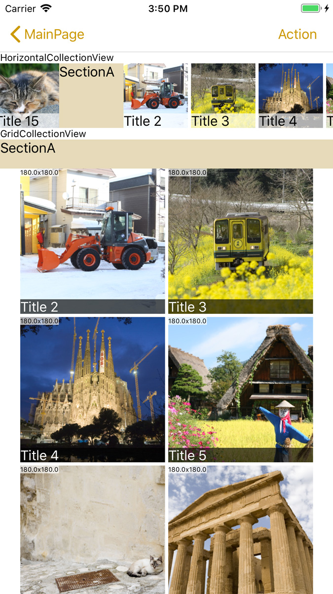

# CollectionView for Xamarin.Forms

This is a flexible ListView that has a grid and horizontal layout with reusable cells for Xamarin.Forms (Android / iOS).

[Japanese](./README-ja.md)


## Available controls

* [GridCollectionView](#gridcollectionview)
    * The ListView that lays out each item in a grid pattern.
* [HCollectionView](#hcollectionview) (HorizontalCollectionView)
    * The ListView that lays out each item horizontally.

## Minimum Platform OS Version 

iOS: iOS10  
Android: version 5.1.1 (only FormsAppcompatActivity) / API22

## Demo

 

<a href="https://www.youtube.com/watch?feature=player_embedded&v=qF4sVnE5Dao
" target="_blank"></a>

## Get Started

### Nuget Installation

[https://www.nuget.org/packages/AiForms.CollectionView/](https://www.nuget.org/packages/AiForms.CollectionView/)

```bash
Install-Package AiForms.CollectionView -pre
```

You need to install this nuget package to .NETStandard project and each platform project.

### For iOS project

To use on iOS, you need to write some code in AppDelegate.cs.

```csharp
public override bool FinishedLaunching(UIApplication app, NSDictionary options) {
    global::Xamarin.Forms.Forms.Init();

    AiForms.Renderers.iOS.CollectionViewInit.Init(); //need to write here

    LoadApplication(new App(new iOSInitializer()));

    return base.FinishedLaunching(app, options);
}
```

### Using with XAML 

#### For GridCollectionView

```xml
<ContentPage 
    xmlns="http://xamarin.com/schemas/2014/forms" 
    xmlns:x="http://schemas.microsoft.com/winfx/2009/xaml" 
    xmlns:ai="clr-namespace:AiForms.Renderers;assembly=CollectionView"
    x:Class="Sample.Views.Test">
    <ai:GridCollectionView 
        ItemsSource="{Binding ItemsSource}" TouchFeedbackColor="Yellow"
        ColumnWidth="100" ColumnHeight="1.0" >
        <ListView.ItemTemplate>
            <DataTemplate>
                <ai:ContentCell>
                    <Label Text="{Binding Name}" />
                </ai:ContentCell>
            </DataTemplate>
        </ListView.ItemTemplate>
    </ai:GridCollectionView>
</ContentPage>
```

#### For HCollectionView

```xml
    ...
    <ai:HCollectionView 
        ItemsSource="{Binding ItemsSource}" TouchFeedbackColor="Yellow"
        ColumnWidth="100" HeightRequest="100" Spacing="4" IsInfinite="true" >
        <ListView.ItemTemplate>
            <DataTemplate>
                <ai:ContentCell>
                    <Label Text="{Binding Name}" />
                </ai:ContentCell>
            </DataTemplate>
        </ListView.ItemTemplate>
    </ai:HCollectionView>
```

#### For Grouped GridCollectionView 

```xml
    ...
    <ai:GridCollectionView 
        ItemsSource="{Binding ItemsSource}" TouchFeedbackColor="Yellow"
        ColumnWidth="100" ColumnHeight="1.0"
        IsGroupingEnabled="true" GroupHeaderHeight="36"   >
        <ListView.GroupHeaderTemplate>
            <DataTemplate>
                <ai:ContentCell>
                    <Label Text="{Binding Category}" BackgroundColor="#E6DAB9" />
                </ai:ContentCell>
            </DataTemplate>
        </ListView.GroupHeaderTemplate>
        <ListView.ItemTemplate>
            <DataTemplate>
                <ai:ContentCell>
                    <Label Text="{Binding Name}" />
                </ai:ContentCell>
            </DataTemplate>
        </ListView.ItemTemplate>
    </ai:GridCollectionView>
```

How to setting a Grouped HCollectionView is the same as the abobe.

> Note that the root of DataTemplate must be arranged not a ViewCell but a ContentCell.

### A example of how to create grouped items source

```cs
public class PhotoGroup : ObservableCollection<PhotoItem>
{
    public string Head { get; set; }
    public PhotoGroup(IEnumerable<PhotoItem> list) : base(list) { }
}

public class PhotoItem
{
    public string PhotoUrl { get; set; }
    public string Title { get; set; }
    public string Category { get; set; }
}

public class SomeViewModel
{
    public ObservableCollection<PhotoGroup> ItemsSource { get; } = new ObservableCollection<PhotoGroup>();

    public SomeViewModel()
    {
        var list1 = new List<PhotoItem>();
        for (var i = 0; i < 20; i++)
        {
            list1.Add(new PhotoItem
            {
                PhotoUrl = $"https://example.com/{i + 1}.jpg",
                Title = $"Title {i + 1}",
                Category = "AAA",
            });
        }
        var list2 = new List<PhotoItem>();
        for (var i = 20; i < 40; i++)
        {
            list2.Add(new PhotoItem
            {
                PhotoUrl = $"https://example.com/{i + 1}.jpg",
                Title = $"Title {i + 1}",
                Category = "BBB",
            });
        }

        var group1 = new PhotoGroup(list1) { Head = "SectionA" };
        var group2 = new PhotoGroup(list2) { Head = "SectionB" };

        ItemsSource.Add(group1);
        ItemsSource.Add(group2);
    }
}
```

### A example of how to use LoadMoreCommand and SetLoadMoreCompletion.

```xml
<ai:GridCollectionView 
    ItemsSource="{Binding ItemsSource}"
    LoadMoreCommand="{Binding LoadMoreCommand}"
    SetLoadMoreCompletion="{Binding SetLoadMoreCompletion}" >
    ...omitting
</ai:GridCollectionView>
```

```cs
public class SomeViewModel
{
    public ObservableCollection<Item> ItemsSource { get; } = new ObservableCollection<Item>();
    public Command LoadMoreCommand { get; set; }
    public Action<bool> SetLoadMoreCompletion { get; set; }

    public async Task LoadMoreCommandExecute()
    {
        var items = await WebApi.GetItems(10);

        if(items.Count == 0)
        {
            SetLoadMoreCompletion(true); // All the items was loaded.
            return;
        }

        foreach(var item in items)
        {
            ItemsSource.Add(item);
        }

        SetLoadMoreCompletion(false); // All the items is not still loaded.
    }
}
```

## Available functions deriving from ListView

### Bindable properties

* ItemsSource
* IsGroupingEnabled
* ItemTemplate
* GroupHeaderTemplate
* BackgroundColor
* IsPullToRefreshEnabled – only GridCollectionView
* RefreshCommand – only GridCollectionView
* IsRefreshing – only GridCollectionView

### Events

* ItemTapped

### Methods

* ScrollTo

### Caching Strategy

ListView's Caching Strategy is available for both GridCollectionView and HCollectionView.
Note that ListView uses RetainElement by default but CollectionView uses RecycleElement.

Since ListViewCachingStrategy is not a property, it must be set using "x:Arguments" syntax from XAML for changing to the other value.

```xml
<ai:HCollectionView ...>
    <x:Arguments>
        <ListViewCachingStrategy>RetainElement</ListViewCachingStrategy>
    </x:Arguments>
    ...
</ai:HCollectionView>
```

Alternatively, it is set using code from C#.

```cs
var collectionView = new HCollectionView(ListViewCachingStrategy.RetainElement);
```

## For images

If you use images for a data template item, using **[FFImageLoading](https://github.com/luberda-molinet/FFImageLoading)** is recommended powerfully.
Because this library doesn't contain the feature of such as dealing with images asynchronously and caching.

## Common Bindable Properties (GridCollectionView / HCollectionView)

* ItemTapCommand
  * The command invoked when an item is tapped.
* ItemLongTapCommand
  * The command invoked when an item is pressed longly.
* TouchFeedbackColor
  * The color rendered when an item is touched.
* GroupFirstSpacing
  * The spacing of the first item's top(Grid) or left(H) in a group.
  * If the grouping is not enabled, it is applied to the first item.
* GroupLastSpacing
  * The spacing of the last item's bottom(Grid) or right(H) in a group.
  * If the grouping is not enabled, it is applied to the last item.
* LoadMoreCommand
  * The command invoked when appearing the last item is detected.
* SetLoadMoreCompletion
  * If it continues using the LoadMore after doing some process, set false; Otherwise set true.
  * Once the LoadMoreCommand is invoked, it will not be invoked again unless the SetLoadMoreCompletion is set to false.
* LoadMoreMargin
  * The number of items from the last as the threshold value to invoke the LoadMoreCommand. For example, if set this property to 3, when appearing the 3rd item from the last, the LoadMoreCommand will be invoked. This value is approximate. the default value is 0.

## GridCollectionView

This is the ListView that lays out each item in a grid pattern. Though this is similar to [WrapLayout](https://github.com/muak/AiForms.Layouts#wraplayout), is different from it in that cells can be recycled.

### Bindable Properties

* [GridType](#gridtype-enumeration)
    * Select grid layout type using an enumeration value either UniformGrid or AutoSpacingGrid. (Default: AutoSpacingGrid)
* PortraitColumns
    * The number of columns displayed on portrait mode when GridType is UniformGrid.
* LandscapeColumns
    * The number of columns displayed on landscape mode when GridType is UniformGrid.
* RowSpacing
    * The spacing between each row.
* ColumnSpacing
    * The spacing between each column when GridType is UniformGrid or AutoSpacingGrid with setting SpacingType to center.
* ColumnWidth
    * The width of a column when GridType is AutoSpacingGrid.
* ColumnHeight
    * The height of a column. If the value is less than or equal to 5.0, it is used as the ratio of the width: Otherwise used as the absolute size.
* AdditionalHeight
    * The additional height of ColumnHeight. Combining this value with ColumnHeight ratio value, Total height can be set such as 100% + 15px for example.
* GroupHeaderHeight
    * The height of a group header cell.
* [SpacingType](#spacingtype-enumeration)
    * Select the spacing type using an enumeration value either Between or Center. This is used only when GridType is AutoSpacingGrid. (Default: Between)
* BothSidesMargin
  * The margin of the right and left sides in the content area except for a group header cell. This is used only when GridType is UniformGrid. (Default: 0)
* PullToRefreshColor
    * The color of the PullToRefresh indicator icon.
* IsGroupHeaderSticky
  * Whether a group header is fixed at the top. (iOS only) (default: true)
* [The other common properties](#Common-Bindable-Properties-GridCollectionView--HCollectionView)

### Special Properties

* ComputedWidth – ReadOnly
    * The column width after being calculated when using UniformGrid in particular. 
  
    > Note that this value can sometimes make 1 pixel difference from the actual width.

* ComputedHeight – ReadOnly
  * The column height after being calculated.

### <a href="#gridtype"></a>GridType Enumeration

* UniformGrid
    * The number of columns arranged in each row is specified. Each column width becomes the width obtained by dividing the row width by that value. This number of columns can be set by PortraitColumns and LandscapeColumns properties.
* AutoSpacingGrid
    * Once a column width is specified, each column is arranged until fitting in each row and adjusted automatically each spacing. A column width can be set by ColumnWidth property and Setting SpacingType property can change how to adjust the spacing.

### <a href="#spacingtype"></a>SpacingType Enumeration

* Between
  * Both side items are arranged to each edge without spacing. The other items are uniformly arranged in the remained space.
* Center
  * Each item is uniformly arranged with the specified spacing, and the remained space is assigned to each edge.

## HCollectionView

This is the ListView that lays out each item horizontally. This can make the scroll circulated by setting IsInfinite property to true. HCollectionView also recycles cells.

### Bindable Properties

* ColumnWidth
    * The width of a column.
* Spacing
    * The spacing between each column.
* GroupHeaderWidth
    * The width of a group header cell.
* IsInfinite
    * Whether making the scroll circulated. (Default: false)

    > On iOS, it must be the number of cells enough to fill the container width.
    > On Android, it could reach each edge if keep scrolling for so long, because it is semi-infinite.
* [The other common properties](#Common-Bindable-Properties-GridCollectionView--HCollectionView)

### About Row Height

HCollectionView height is decided by the HeightRequest value or itself size.

## <a href="#scrollcontroller"></a>ScrollController

This is the object which allows methods for scrolling to be called from such as ViewModel.
The following code is the example calling ScrollTo method from ViewModel:

```cs
public class SomeViewModel
{
    public ObservableCollection<string> ItemsSource { get; } = new ObservableCollection<string>{ new List<string>{"A","B","C"} };
    public IScrollController ScrollController { get; set; }

    ...
    public GoToItem(int target)
    {
        // Scroll to the specified item position at the first visible area position with animation. If the target is 1, scroll to "B".
        ScrollController.ScrollTo(ItemsSource[target],ScrollToPosition.Start,true);
    }
    public GoToStart()
    {
        ScrollController.ScrollToStart(true); // scroll to "A" with animation
    }
    public GoToEnd()
    {
        ScrollController.ScrollToEnd(true); // scroll to "C" with animation
    }
}
```

```xml
<ai:GridCollectionView 
    ItemsSource="{Binding ItemsSource}"
    ScrollController="{Binding ScrollController}"
    ...
>
</ai:GridCollectionView>
```

### IScrollController Methods

* ScrollTo
    * ``void ScrollTo(object sourceItem, ScrollToPosition scrollToPosition, bool animated = true)``
    * ``void ScrollTo(object sourceItem, object sourceGroup ,ScrollToPosition scrollToPosition, bool animated = true)``
    * Scroll to specified item. This method is the same as that of ListView.
    * Note that the argument item is not a cell but an ItemsSource element.
* ScrollToStart
    * ``void ScrollToStart(bool animated = true)``
    * Scroll to the top-most or left-most position.
* ScrollToEnd
    * ``void ScrollToEnd(bool animated = true)``
    * Scroll to the bottom-most or right-most position.

## License

The MIT Licensed.

Some code is taken from [Xamarin.Forms](https://github.com/xamarin/Xamarin.Forms).